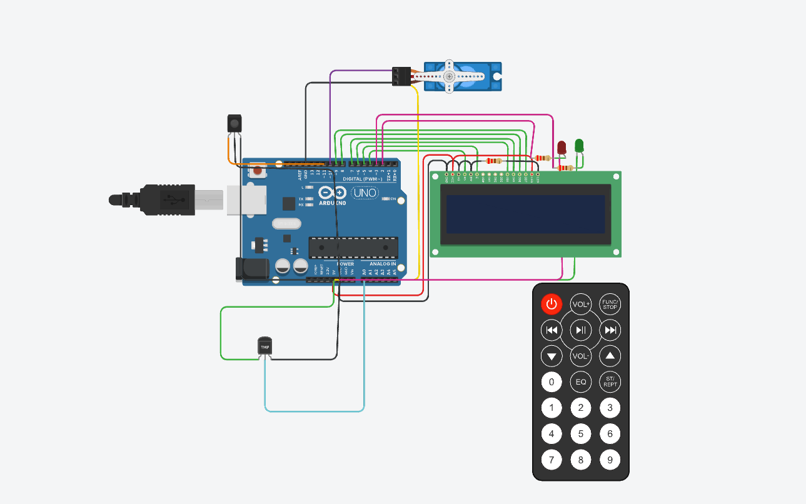

## Funcionamiento Integral del Sistema

El sistema de incendio con Arduino tiene como objetivo detectar cambios de temperatura y activar un servo motor en caso de detectar un incendio. Además, muestra la temperatura actual y la estación del año en un display LCD. A continuación, se explica el funcionamiento integral del sistema paso a paso:

1. **Conexiones:** Se deben realizar las siguientes conexiones entre los componentes y Arduino:
   - Conectar el sensor de temperatura al pin analógico A0 de Arduino.
   - Conectar el control remoto IR al pin digital 11 de Arduino.
   - Conectar el display LCD utilizando los pines correspondientes de Arduino.
   - Conectar el servo motor a un pin PWM de Arduino, como el pin 9.
   - Conectar los LEDs a los pines correspondientes de Arduino.

**Diagrama de Conexiones**





2. **Control Remoto IR:** Configura el control remoto IR para que pueda enviar señales reconocibles por el sistema. Se definen los comandos necesarios para activar y desactivar el sistema de incendio, así como para cambiar la estación del año.


```arduino

   // funcion para manejar el control.
void manejarControlRemoto() {
  if (IrReceiver.decode()) {
    Serial.println(IrReceiver.decodedIRData.decodedRawData, HEX);

    if (IrReceiver.decodedIRData.decodedRawData == power) // Código para activar el sistema
    {
      activarSistema();
      lcd.clear();
      lcd.print("Sistema activado");
      delay(1000);
      lcd.clear();
    }

    if (sistemaActivado) {
      if (IrReceiver.decodedIRData.decodedRawData == stop)  // Código para desactivar el sistema
      {
        desactivarSistema();
        lcd.clear();
        lcd.print("Sistema desactivado");
        delay(1000);
      }

      if (IrReceiver.decodedIRData.decodedRawData == Tecla_1) // Código para cambiar la estación a Invierno
      {
        cambiarEstacion("Invierno");
      }

      if (IrReceiver.decodedIRData.decodedRawData == Tecla_2) // Código para cambiar la estación a Otoño
      {
        cambiarEstacion("Otonio");
      }

      if (IrReceiver.decodedIRData.decodedRawData == Tecla_3) // Código para cambiar la estación a Verano
      {
        cambiarEstacion("Verano");
      }

      if (IrReceiver.decodedIRData.decodedRawData == Tecla_4) // Código para cambiar la estación a Primavera
      {
        cambiarEstacion("Primavera");
      }
    }

    IrReceiver.resume(); // Reanuda la recepción de códigos IR
  }
}
//...
```
3. **Detección de Temperatura:**
   - Configura el sensor de temperatura y realiza la lectura de la temperatura ambiente utilizando el pin analógico A0.
   - Muestra la temperatura actual en el display LCD para que sea visible.
```arduino

   // funcion para retornar la temperatura como entero

int obtenerUmbralEstacion(String estacion) {
  if (estacion == "Verano") {
    return umbralVerano;
  } else if (estacion == "Primavera") {
    return umbralPrimavera;
  } else if (estacion == "Otonio") {
    return umbralOtono;
  } else if (estacion == "Invierno") {
    return umbralInvierno;
  } else {
    // Estación no válida, retorna un umbral alto para evitar disparar la alarma
    return 100;
  }
}

//...
```
4. **Sistema de Alarma:**
   - Se define un umbral de temperatura a partir del cual se considera que hay un incendio. Por ejemplo, se establece un umbral de 60 grados Celsius.
   - Cuando la temperatura medida supera el umbral establecido, se activa el servo motor para simular una respuesta del sistema de incendio. El servo motor se mueve para abrir una compuerta o activar un mecanismo determinado.
   - Al mismo tiempo, se muestra un mensaje de alarma en el display LCD indicando la detección de fuego.

5. **Interfaz del Display LCD:**
   - Se utiliza el display LCD para mostrar la temperatura actual y la estación del año.
   - La temperatura se muestra en una línea del display con un mensaje como "Temp: XX°C", donde XX representa el valor de temperatura.
   - La estación del año se muestra en la segunda línea del display con un mensaje como "Estacion: Verano", "Estacion: Primavera", etc.

```arduino

   // 4 Y 5 Funciones de  sistema de alarma junto LCD
void activarAlarma() {
  if (estacion != "") { // Verificar si la estación es válida
    lcd.clear();
    lcd.print("¡Fuego detectado!");
    servoMotor.write(90); // Abre el servo motor para simular una respuesta del sistema de incendio
    delay(5000); // Mantiene el servo motor abierto durante 5 segundos
    servoMotor.write(0);// Cierra el servo motor
    lcd.clear();
  }
}

void activarSistema() {
  sistemaActivado = true;
}

void desactivarSistema() {
  sistemaActivado = false;
  lcd.clear(); // Limpia el LCD al desactivar el sistema
}

void cambiarEstacion(String nuevaEstacion) {
  estacion = nuevaEstacion;
}

//...
```

6. **Indicadores LED:**
   - Mientras la temperatura este correcta y no haya peligro de incendio se mantiene prendido el led verde en señal de normalidad, cuando llega el incendio se prende el led rojo en señal de alerta, cuando esta deja de correr peligro se apaga y enciende verde nuevamente
   -Se maneja dentro del loop principal

El funcionamiento integral del sistema se basa en la interacción de los componentes y la ejecución del código en Arduino. Se realiza la lectura de la temperatura, se comprueba si se ha superado el umbral establecido y se activa el servo motor en caso de detectar un incendio. Toda la información relevante se muestra en el display LCD para una fácil visualización.


```arduino

   // Definiciones
#include <IRremote.h>
#include <LiquidCrystal.h>
#include <IRremote.h>
#include <Servo.h>
#define power 0xFF00BF00
#define stop 0xFD02BF00
#define Tecla_1 0xEF10BF00
#define Tecla_2 0xEE11BF00
#define Tecla_3 0xED12BF00
#define Tecla_4 0xEB14BF00
#define SENSOR_TEMPERATURA A0
#define IR 11
#define PIN_LCD_RS 4
#define PIN_LCD_EN 5
#define PIN_LCD_D4 6
#define PIN_LCD_D5 7
#define PIN_LCD_D6 8
#define PIN_LCD_D7 9
#define PIN_SERVO 10
#define PIN_LED_1 2
#define PIN_LED_2 3

LiquidCrystal lcd(PIN_LCD_RS, PIN_LCD_EN, PIN_LCD_D4, PIN_LCD_D5, PIN_LCD_D6, PIN_LCD_D7);

Servo servoMotor;

// Umbral de temperatura para cada estación (en grados Celsius)
int umbralVerano = 60;
int umbralPrimavera = 50;
int umbralOtono = 70;
int umbralInvierno = 80;

bool sistemaActivado = false;
String estacion = "";

//...
```

```arduino
//VOID SETUP

void setup() {
  lcd.begin(16, 2);
  Serial.begin(9600);
  IrReceiver.begin(IR, DISABLE_LED_FEEDBACK);
  servoMotor.attach(PIN_SERVO);
  servoMotor.write(0); // Inicialmente, el servo motor está en posición cerrada

  pinMode(PIN_LED_1, OUTPUT);
  pinMode(PIN_LED_2, OUTPUT);
}


//...
```
```arduino
//void loop principal

void loop() {
  manejarControlRemoto();

  if (sistemaActivado) {
    int lecturaTemperatura = leerTemperatura();

    lcd.setCursor(0, 0);
    lcd.print("Temp: ");
    lcd.print(lecturaTemperatura);
    lcd.print("C");

    lcd.setCursor(0, 1);
    lcd.print("Estacion: ");
    lcd.print(estacion);

    if (lecturaTemperatura > obtenerUmbralEstacion(estacion)) {
      digitalWrite(PIN_LED_2, LOW);
      digitalWrite(PIN_LED_1, HIGH);
      activarAlarma();
      digitalWrite(PIN_LED_1, LOW);
    }else{
      digitalWrite(PIN_LED_2, HIGH);
    }

  } else {
    digitalWrite(PIN_LED_2, LOW);
    
  }
}
```